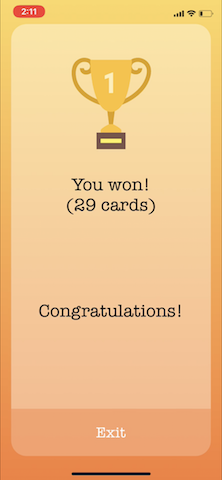

# Tap It!

## Overview
Tap It! is an iOS multipeer card game.
Test your observational skills and your reflexes with your friends. A game of fast-paced choices for up to eight players.

## Game Play

### Rules

Each player can see the top card from the deck (top card) and your own card (bottom card). The objective is to found the figure repeated on both cards. If you click faster than the other players, you get the card and the deck card changes to everyone. If you tap the wrong figure, you get block by 3 seconds or until other player find their respective figure. When deck cards are out, win who owns the largest number of cards.

### The Game

Insert your name and wait for yours friends.

When everybody is ready, tap the Let's Play button and the game begins.

Tapping the correct image:

Tapping the wrong image:

Final of the game:

## Tech Stack

* Swift
* MultipeerConnectivity
* Binary Data Structure
* UIKit

### Multipeer Connectivity

The game was made to play offline, between nearby devices. The app choose the best connection option (WiFi or Bluetooth) and create a server for the others players.

### Binary Data Structure

We decide to use the binary data structure to minimize the data flow between the peers, avoiding lag during the game.

### UIKit

As a final project of Lighthouse Labs, we decide to use the UIKit as a challenge and to show that is possible to make a fun game without libraries as GameKit and SpriteKit.

## Future Directions

Features we would like to include in future version:
* Connectivity multi-plataform
* History of plays and statistics (e.g. avg time to found, number of wins)

## Contributors
* [Fernando Zanei](https://github.com/fernandozanei)
* [Jonathan Oliveira](https://github.com/jonthejon)
